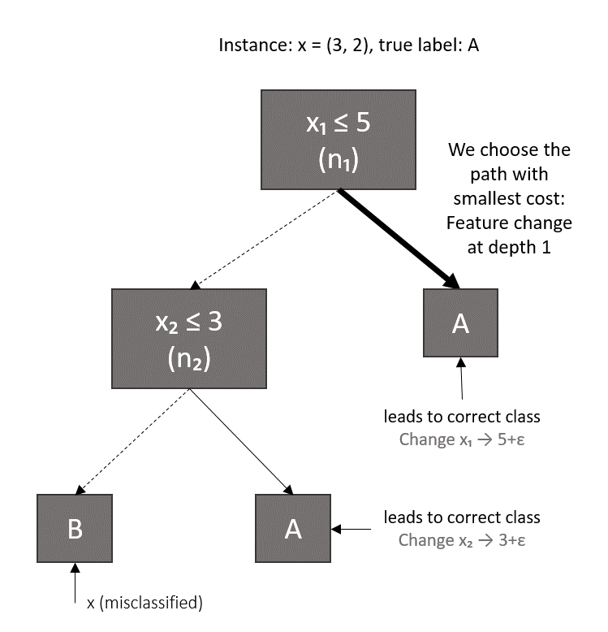

# Read & Write Epochs for Decision Trees (RWDT)

A novel approach that iteratively refines training data representations by computing corrections toward correct classification paths in decision trees.

## Overview

Traditional machine learning operates in a *read-only* paradigm where training data remains fixed during learning. **RWDT** introduces *read & write epochs* — iterative cycles where the model:

1. **Reads**: Fits a decision tree to learn decision boundaries
2. **Writes**: Identifies misclassified samples and computes feature corrections to guide them toward correct leaf nodes
3. **Repeats**: Continues for multiple epochs until convergence

This process enables decision trees to achieve higher accuracy while maintaining their interpretability advantage over ensemble methods.



## Installation

```bash
git clone https://github.com/anonrw/rwdt.git
cd rwdt
pip install -r requirements.txt
```

### Requirements

- Python 3.8+
- NumPy
- pandas
- scikit-learn
- OpenML

## Quick Start

```python
from rwdt import RWDT

# Initialize RWDT
model = RWDT(max_depth=5, n_iterations=10, learning_rate=0.3)

# Fit on training data
model.fit(X_train, y_train)

# Predict
predictions = model.predict(X_test)
```

## Running Experiments

To reproduce the experiments from the paper:

```bash
python rwdt.py
```

### Example Output

```
======================================================================
Read & Write Epochs for Decision Trees (RWDT)
======================================================================

----------------------------------------------------------------------
Loading dataset: mfeat-karhunen
Dataset: mfeat-karhunen
  Samples: 2000
  Features: 64
  Classes: 10

Running experiments...
  5-fold CV × 5 seeds
  Hyperparameters: 4 depths × 5 LRs × 7 iterations

  Completed seed 1/5
  Completed seed 2/5
  Completed seed 3/5
  Completed seed 4/5
  Completed seed 5/5

Best RWDT configuration for mfeat-karhunen:
  max_depth=3, lr=0.3, n_iter=20

Performance (mean ± std):
  Decision Tree: 44.44% ± 1.37%
  RWDT:          52.57% ± 1.97%

Improvement over Decision Tree:
  RWDT: +8.13%
```

## How It Works

### The Read & Write Epoch

Each epoch consists of three phases:

1. **Tree Fitting (Read)**: Train a decision tree on the current data state
2. **Error Detection**: Identify samples that are misclassified by the tree
3. **Feature Correction (Write)**: For each misclassified sample, compute the minimum feature adjustment needed to reach a leaf with the correct class

### Correction Computation

For a misclassified sample, RWDT finds the *critical split* — the decision node closest to the root where taking the opposite branch leads to correct classification. The correction adjusts the relevant feature to cross the decision threshold:

```
x_new = x + α × (threshold - x + ε × sign(threshold - x))
```

Where:
- `α` is the learning rate (correction rate)
- `ε` is a small margin to ensure the threshold is crossed

Note: This is **not** a gradient in the mathematical sense (no differentiation is involved). It is a discrete correction computed via path search through the tree structure.

## Hyperparameters

| Parameter | Description | Default | Recommended Range |
|-----------|-------------|---------|-------------------|
| `max_depth` | Maximum depth of the decision tree | 5 | 3-10 |
| `n_iterations` | Number of read-write epochs | 10 | 1-20 |
| `learning_rate` | Correction rate for feature adjustments | 0.2 | 0.1-0.5 |

## Results

Evaluated on 179 datasets from OpenML-CC18 and PMLB benchmarks:

| Metric | Value |
|--------|-------|
| Win Rate | 94.4% |
| Mean Improvement | +1.30% |
| Median Improvement | +0.82% |
| Statistical Significance | p < 10⁻³⁰ (Wilcoxon) |

### Top Performing Datasets

| Dataset | DT Accuracy | RWDT Accuracy | Improvement |
|---------|-------------|---------------|-------------|
| analcatdata_aids | - | - | +8.80% |
| mfeat-karhunen | 44.44% | 52.57% | +8.13% |
| mfeat-factors | 59.42% | 65.47% | +6.05% |

## Files

- `rwdt.py` — Main script containing the RWDT implementation and experiment code


## License

This project is licensed under the MIT License - see the [LICENSE](LICENSE) file for details.

## Acknowledgments

- OpenML for providing the CC18 benchmark suite
- PMLB for the Penn Machine Learning Benchmarks
